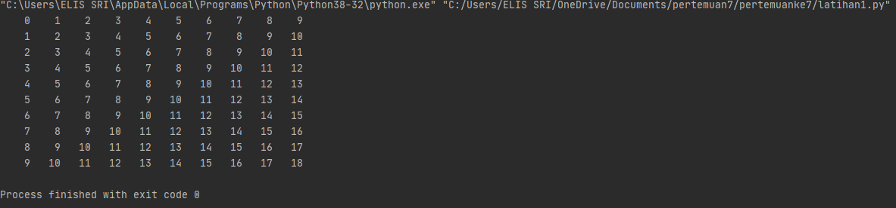

# PERTEMUAN 7
### NAMA: EUIS SRI MULYANI <br>
### KELAS: TI. 20. A. 1 <br>
### NIM: 312010457<br>

__________________________________________________________________________________

## PRAKTIKUM 1 - LATIHAN 1
Jadi pada pertemuan ini saya diberikan beberapa tugas oleh dosen saya yaitu diantaranya:

Pada tugas pertama, saya diminta untuk membuat sebuah program pengulangan bertingkat yang nantinya akan menghasilkan output seperti gambat diatas.
Untuk bisa dapat menghasilkan output tersebut maka saya memasukan syntax:
```python
baris = 10
kolom = baris

for bar in range(baris):
    for col in range(kolom):
        tab = bar+col
        print("{0:>5}".format(tab), end='')
    print()
```
Mengapa demikian? Karena untuk dapat melakukan pengulangan bertingkat kamu perlu memasukan 
```python
for bar in range(baris):
    for col in range(kolom):
        tab = bar+col
        print("{0:>5}".format(tab), end='')
    print()
```
dan karena pada syntax tersebut kamu membutuhkan baris dan kolom maka sebelum memasukan syntax diatas kamu perlu menambahkan keterangan baris dan kolom sesuai yang kalian butuhkan seperti ini.
```python
baris = 10
kolom = baris
```
Jika sudah memasukan semua syntax diatas dan telah di run, maka kamu akan mendapatkan tampilan seperti gambar yang ada dibawah ini


## PRAKTIKUM 1 - LATIHAN 2

 <br>

Di tugas ke dua, saya diminta untuk mencari nilai acak yang bernominal dibawah 0,5. Maka saya memasukan syntax:
```python
import random
print(40*"=")
print("Bilangan random yang lebih kecil dari 0,5")
print(40*"=")
jum = int( input("Masukan nilai n : "))
i = 0
for i in range(jum):
    i += 1
    angkaDec = random.uniform(0, 0.5)
    print("Data ke", i, " = ", angkaDec)
```
Syntax dibawah ini digunakan untuk mencari nilai random
```python
import random
```
Sementara untuk menentukan jumlah input yang diinginkan maka perlu memasukan
```python
jum = int( input("Masukan nilai n : "))
```
dan untuk menampilkan urutan data sesuai jumlah inputan dengan hasil di bawah 0.5 perlu memasukan
```python
angkaDec = random.uniform(0, 0.5)
    print("Data ke", i, " = ", angkaDec)
```
Jika sudah memasukan semua syntax diatas dan telah di run, maka kamu akan mendapatkan tampilan seperti gambar yang ada dibawah ini


